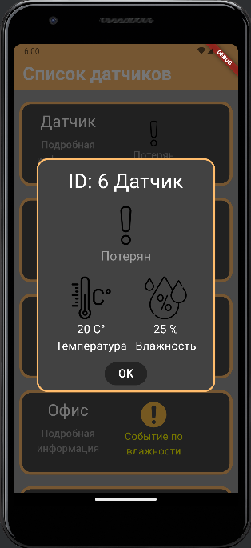

# Тестовое задание
## Задание:
Необходимо реализовать приложение для отображения датчиков.

Приложение должно позволять пользователю:

- просматривать список всех датчиков;
- просматривать полную информацию о датчиках;

Список датчиков должен содержать краткую информацию, вы должны предусмотреть возможность просмотра полной информации для каждого датчика.

Обратите внимание на то, что некоторые поля могут отсутствовать, Вам необходимо
самим решить, что с ними правильнее сделать.

«Красивое» оформление экранов приветствуется, однако совсем не обязательно на этом
зацикливаться.

## Решение задачи
Объяснение кода:

1. main(): Точка входа в приложение.
2. MyApp: Основной виджет приложения и точка входа в начальный экран.
3. Home: Экран списка датчиков.
    * decode() загружает данные из JSON-файла при инициализации экрана.
4. ListView.builder: Виджет для отображения одного датчика в списке.
    * decodeStatusText() получение текста по номеру статуса
    * decodeStatusImage() получение изображения по номеру статуса
    * decodeStatusColor() получение цвета по номеру статуса
6. DialogFullInformation: Экран с подробной информацией о датчике.
    * Отображает sensorId, name, status (с цветом), temperature и humidity.
7. Detector: Класс для хранения данных о датчике.

Как запустить приложение:

1. Создайте новый Flutter проект.
2. Добавте в папку lib все файлы [.dart (main.dart необходимо заменить на новый)](https://github.com/Mercurrial/test_task_smoke_detectors/tree/main/lib)
3. Создайте папку assets в корне проекта.
4. Скачать папку [images](https://github.com/Mercurrial/test_task_smoke_detectors/tree/main/assets) и положить в созданную папку assets.
5. Заменить pubspec.yaml на [новый](https://github.com/Mercurrial/test_task_smoke_detectors/blob/main/pubspec.yaml).
6. Запустите приложение.

## Инструкция по использованию

1. Запустите приложение.
2. На экране списка датчиков вы увидите список датчиков с их именами и статусами.
3. Нажмите на текст "Подробная информация", чтобы перейти на экран с подробной информацией.
4. На экране с подробной информацией вы увидите ID, имя, статус (с цветом), температуру и влажность датчика.

## Скриншоты

